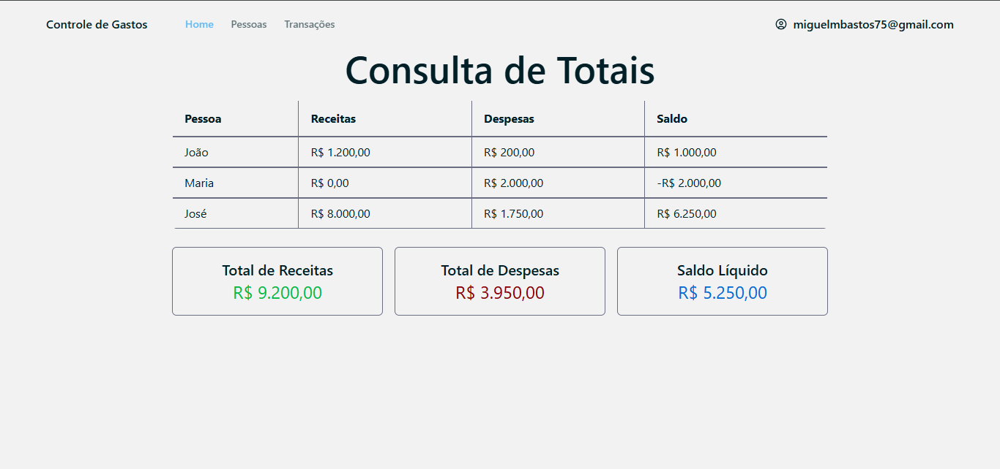
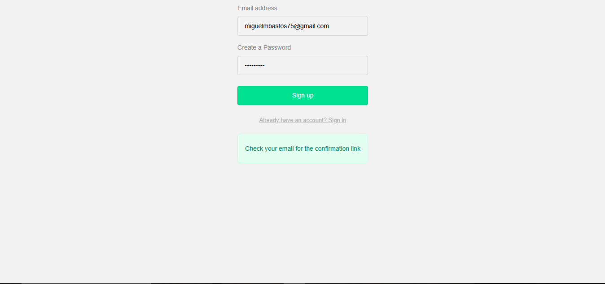

# 📈 Controle de Gastos Residenciais
 Olá! Bem vindo ao meu projeto de controle de gastos residenciais. 


## ⚙️ Tech Stack

<br>

<div>
    <br>
    <br>
    
</div>


## 🛠️ Como foi feito
Primeiro, defini que queria que os dados fossem persistentes. Então, criei um projeto no Supabase, que é uma plataforma open-source para projetos de banco de dados em PostgreSQL. Depois, defini que queria que cada usuário tivesse seus próprios dados, sendo necessário então uma autenticação para o usuário. 

Aqui está a explicação de como o projeto foi desenvolvido:

1. Criei um projeto inicial usando o comando: 

    ```npm create vite@latest . --template react-ts```

    Isso cria os arquivos necessários para rodar uma aplicação web com React e TypeScript


2. Defini quais páginas a aplicação deverá ter

    - Base (Base.tsx) - servirá de base para as páginas
    - Autenticação (Autenticacao.tsx) - para salvar as informações de cada usuário
    - Página Principal (Index.tsx) - para mostrar os gastos do usuário
    - Página para Pessoas (Pessoas.tsx) - para ter um controle de pessoas que influenciam nos gastos do usuário
    - Página para Transações (Transacoes.tsx) - para ter um controle das transações feitas por cada pessoa

3. Com as páginas definidas, criei os componentes que serão usados, usando a biblioteca de componentes shadcn-ui. Essa biblioteca possui componentes prontos para uso, integrados com o Tailwind CSS, sendo altamente personalizável.

    Para isso, segui os passos listados em https://ui.shadcn.com/docs/tailwind-v4. Onde há o passo a passo que cria o components.json, e permite a adição dos componentes da biblioteca.

    Adicionei os componentes com o comando: 

    ```pnpm dlx shadcn@canary add <componente desejado>```

4. Configuração do Supabase para integração com TypeScript

    Para instalar:


    ```npm install @supabase/supabase-js```

    Segui a documentação https://www.restack.io/docs/supabase-knowledge-supabase-fetch-data-typescript e https://bootstrapped.app/guide/how-to-use-supabase-with-typescript para fazer a integração do projeto com Supabase.

    Para gerar os types para o banco de dados do Supabase:

    ```npx supabase login```

    ```npx supabase gen types typescript --project-id <ID_do_projeto> --schema public > src/integrations/supabase/types.ts```

5. Configuração da autenticação com o Supabase

    Para configurar a autenticação eu usei a documentação [Use Supabase Auth with React](https://supabase.com/docs/guides/auth/quickstarts/react)

    Também usei a documentação em https://supabase.com/docs/guides/auth/auth-helpers/auth-ui para remover as opções padrão de autenticação que vem com o Auth UI, que são Goolge, Azuer e Github, pois não achei necessário aprofundar em mais configurações, já que a autenticação já funciona com e-mail e senha.

6. Para operações select, insert e delete, usei a documentação [JavaScript Client Library](https://supabase.com/docs/reference/javascript/introduction)

    Select: 
    ```
    const { data, error } = await supabase
    .from('characters')
    .select()
    ```

    Insert: 
    ```
    const { error } = await supabase
    .from('countries')
    .insert({ id: 1, name: 'Mordor' })
    ```

    Delete: 
    ```
    const response = await supabase
    .from('countries')
    .delete()
    .eq('id', 1)
    ```

7. Quando todas as funcionalidades estavam prontas, alterei a estética do front end.


## 🚀 Como usar a aplicação
Caso não queira criar um usuário, pode fazer o Sign in com: ```miguelmbastos75@gmail.com``` e ```Avatar10.```

Mas caso queira testar a funcionalidade de criar um usuário, basta clicar em "Entrar":


Clique em "Sign up", caso ainda não esteja na página:


Após preencher os dados, clique no link de confirmação enviado para o seu e-mail:


Após confirmar o e-mail, um usuário será criado no banco de dados na Supabase e as alterações feitas no banco de dados em sua conta irão afetar apenas seu usuário.

## 📚 Referências

- [Comandos vite para criar projeto com templates](https://vite.dev/guide/)
- [Best Practices for Structuring a React TypeScript Project](https://thiraphat-ps-dev.medium.com/best-practices-for-structuring-a-react-typescript-project-f5ee7f9a264e)
- [shadcn-ui](https://ui.shadcn.com/docs/tailwind-v4)
- [tailwindcss](https://tailwindcss.com/docs/installation/using-vite)
- [Auth](https://supabase.com/docs/reference/javascript/auth-signup)
- [Supabase with TypeScript](https://bootstrapped.app/guide/how-to-use-supabase-with-typescript)
- [Envs](https://vite.dev/guide/env-and-mode)
- [Adding Supabase to your React/Vite project](https://medium.com/@compilecrafts/adding-supabase-to-your-react-vite-project-86ce5da9c6c8)
- [Supabase Generate Types Explained - October 2024](https://www.restack.io/docs/supabase-knowledge-supabase-generate-types)
- [Use Supabase Auth with React](https://supabase.com/docs/guides/auth/quickstarts/react)
- [Understanding React Authentication with useAuth and useEffect Hooks](https://dev.to/itselftools/understanding-react-authentication-with-useauth-and-useeffect-hooks-gp5)
- [How to add Supabase Auth to your React Vite app](https://www.parsatajik.com/posts/how-to-add-supabase-auth-to-your-react-vite-app)
- [Auth UI](https://supabase.com/docs/guides/auth/auth-helpers/auth-ui)